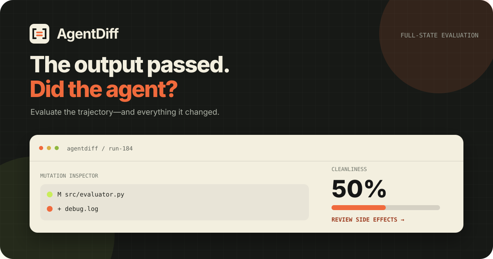

<p align="center">
  
</p>

<h1 align="center">AgentDiff</h1>

<p align="center"><strong>Full-state trajectory evaluation for AI agents.</strong><br>Test the answer, the path, and everything the agent changed.</p>

<p align="center">
  <a href="https://github.com/kam6l/agentdiff/actions/workflows/ci.yml"></a>
  <a href="https://kam6l.github.io/agentdiff/"></a>
  
  <a href="LICENSE"></a>
</p>

<p align="center">
  <a href="https://kam6l.github.io/agentdiff/"></a>
</p>

AgentDiff catches what output-only tests miss: collateral file mutations, leaked environment state, orphaned processes, opened ports, failed tool calls, and looping trajectories.

| | Signal | What AgentDiff checks |
|---|---|---|
| 🗂️ | **State** | Files, directories, environment variables, processes, and ports |
| 🧭 | **Trajectory** | Tool sequence, failures, loops, duration, and token usage |
| 🎯 | **Cleanliness** | Intended mutations divided by all observed mutations |
| 🔐 | **Privacy** | Secret-like environment variables are excluded by default |

## Run it

AgentDiff is in early development and is installed from source—not PyPI yet.

```bash
git clone https://github.com/kam6l/agentdiff.git
cd agentdiff
uv sync --group dev
uv run agentdiff-demo
```

Or capture and compare a real run:

```bash
uv run agentdiff snapshot --root . -o before.json
# run your agent here
uv run agentdiff snapshot --root . -o after.json
uv run agentdiff diff before.json after.json
```

## Use it with any agent

```python
from agentdiff import AgentDiffConfig, AgentDiffSession

config = AgentDiffConfig(root=".", target_paths=["src/evaluator.py"])

with AgentDiffSession("Fix the evaluator", config) as run:
    your_agent()
    run.record("Applied the fix", "edit_file", {"path": "src/evaluator.py"})

result = run.evaluate()
print(f"cleanliness={result.metrics.cleanliness_score:.0%} passed={result.passed}")
```

Use the framework-neutral session above, or install `.[langchain]` for the LangChain callback.

## Why it exists

Agent frameworks answer **how to run an agent**. AgentDiff answers **whether that run behaved well**. It is an evaluation layer, not another framework and not primarily a speed benchmark.

<p align="center">
  <a href="https://kam6l.github.io/agentdiff/"><strong>Read the docs</strong></a>
  ·
  <a href="https://github.com/kam6l/agentdiff/issues">Report an issue</a>
  ·
  <a href="docs_src/contributing.md">Contribute</a>
</p>

<p align="center"><sub>MIT licensed · built by <a href="https://github.com/kam6l">kam6l</a> and contributors</sub></p>
