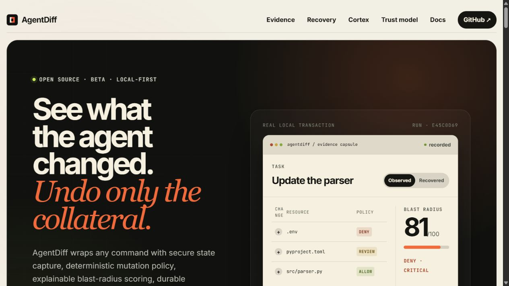
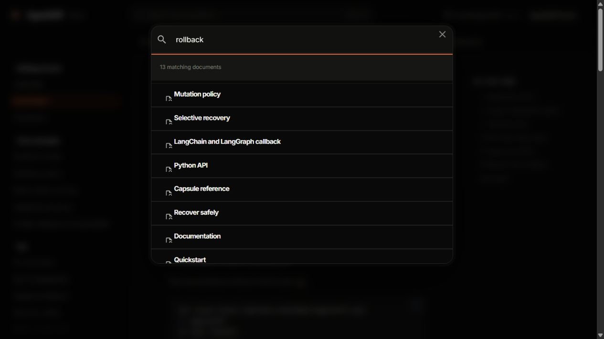

<p align="center">
  <a href="https://kam6l.github.io/agentdiff/">
    
  </a>
</p>

<h1 align="center">AgentDiff</h1>

<p align="center">
  <strong>See what the agent changed. Undo only the collateral.</strong><br>
  A local-first runtime transaction system for AI-agent commands: filesystem evidence, deterministic policy, explainable blast-radius scoring, and conflict-safe recovery.
</p>

<p align="center">
  <a href="https://github.com/kam6l/agentdiff/actions/workflows/ci.yml"></a>
  <a href="https://github.com/kam6l/agentdiff/actions/workflows/deploy.yml"></a>
  
  <a href="LICENSE"></a>
</p>

<p align="center">
  <a href="https://kam6l.github.io/agentdiff/"><strong>Website</strong></a> ·
  <a href="https://kam6l.github.io/agentdiff/docs/"><strong>Documentation</strong></a> ·
  <a href="https://kam6l.github.io/agentdiff/docs/quickstart/"><strong>Quickstart</strong></a> ·
  <a href="https://kam6l.github.io/agentdiff/docs/trust/"><strong>Trust model</strong></a>
</p>

<p align="center">
  <a href="https://kam6l.github.io/agentdiff/">
    
  </a>
</p>

<p align="center"><sub>Real Chromium render of the AgentDiff site. The transaction values come from an executed local run capsule—not a fabricated dashboard.</sub></p>

> [!IMPORTANT]
> AgentDiff's local runtime is an **observation and evidence layer, not a kernel sandbox**. It does not block network access and it cannot undo external APIs, databases, or arbitrary side effects. Use an explicit sandbox backend when you need isolation or network enforcement. Read the [security and capability limits](https://kam6l.github.io/agentdiff/docs/trust/) before using it around sensitive work.

## Why AgentDiff?

A command can exit successfully while leaving one legitimate edit, an unexpected dependency change, and a protected secret file. AgentDiff gives every observed mutation a durable answer:

- **What changed?** No-follow before/after filesystem manifests and runtime evidence.
- **Was it expected?** Deterministic `allow`, `review`, or `deny` policy with rule provenance.
- **How risky was it?** An explainable 0–100 blast-radius score.
- **Can I undo only the collateral?** Conflict-safe recovery preserves allowed work and later edits.

## Quickstart

AgentDiff requires **Python 3.14+** and is currently installed from source:

```bash
git clone https://github.com/kam6l/agentdiff.git
cd agentdiff
uv sync --locked --all-groups

uv run agentdiff policy init
uv run agentdiff run --task "Update the parser" -- python3 agent_task.py
```

Inspect the run ID printed by the command, verify its capsule, then recover only eligible collateral:

```bash
uv run agentdiff inspect <run-id>
uv run agentdiff verify <run-id>
uv run agentdiff rollback <run-id> --safe-only
```

The real example used by the website produced a successful process exit but a denied transaction:

```text
Status: denied (deny)          Blast radius: 81/100 (critical)
deny    created  .env
review  created  pyproject.toml
allow   created  src/parser.py
```

Safe rollback removed the first two paths and kept `src/parser.py`. If a path changes after the run, AgentDiff reports a conflict and leaves it untouched.

[Follow the five-minute quickstart →](https://kam6l.github.io/agentdiff/docs/quickstart/)

## How it works

| Stage | Result |
|---|---|
| **Capture** | Secure baseline plus recoverable file backups |
| **Execute** | Exact argv, exit status, owned-process evidence, and port observations |
| **Evaluate** | Path decisions, rule provenance, warnings, score, and integrity manifest |
| **Recover** | Conservative rollback after an exact post-run conflict check |

## CLI

| Command | Purpose |
|---|---|
| `agentdiff run -- <cmd>` | Wrap an explicit command in a transaction |
| `agentdiff runs` | List durable run capsules |
| `agentdiff inspect <id>` | Read capsule evidence |
| `agentdiff verify <id>` | Validate capsule checksums |
| `agentdiff rollback <id> --safe-only` | Recover `review` and `deny` mutations |
| `agentdiff cleanup <id>` | Signal verified leftover processes |
| `agentdiff doctor` | Report local runtime capabilities |
| `agentdiff policy init/validate/explain` | Create and inspect versioned policy |

Python integrations include `AgentRunTransaction`, `MCPPolicyHook`, an optional Anthropic Sandbox Runtime adapter, and a LangChain/LangGraph callback. See the [CLI reference](https://kam6l.github.io/agentdiff/docs/cli/) and [SDK reference](https://kam6l.github.io/agentdiff/docs/sdk-reference/) for the complete surface.

## Trust boundary

AgentDiff is deliberately conservative: it records symlinks without traversing them, redacts common secrets, verifies backups and capsule checksums, and identifies processes by PID plus creation time. It does **not** make local execution a sandbox, attribute machine-wide port changes to a run, or undo APIs, databases, network effects, hardlinks, or unbacked files.

Read the [runtime model](https://kam6l.github.io/agentdiff/docs/concepts/runtime/), [recovery guarantees](https://kam6l.github.io/agentdiff/docs/concepts/recovery/), and [trust model](https://kam6l.github.io/agentdiff/docs/trust/).

<p align="center">
  <a href="https://kam6l.github.io/agentdiff/docs/cli/">
    
  </a>
</p>

<p align="center"><sub>The documentation site is built from this repository with MkDocs Material and deployed through GitHub Pages.</sub></p>

AgentDiff is alpha software; its schemas and command surface may change before a stable release. [Documentation](https://kam6l.github.io/agentdiff/docs/) · [Security](SECURITY.md) · [Contributing](CONTRIBUTING.md) · [Issues](https://github.com/kam6l/agentdiff/issues)

MIT licensed. Built by [kam6l](https://github.com/kam6l) and contributors.
